# ArXiv Sniffer

[English](./README-en.md)

## 简介

这个项目是一个基于大模型的，筛选和总结arXiv catchup（arXiv的每日订阅页面）论文的程序。

## 本项目能做什么

本项目的核心程序每次运行的时候会执行一下流程：

1. 从arXiv上爬取昨天的catchup页面的内容，并且提取出其中最新提交的论文的条目。
2. 用户可以提前订阅一些主题（其实是在配置文件中使用自然语言描述你关心的主题）。程序会调用大模型的API，对上一个步骤提取到的所有论文进行筛选，选出那些和你关心的主题相关性比较高的论文。这个筛选对于每个主题都分别进行一次。
3. 筛选完成之后，项目会利用一些模板自动为每个主题生成一个展示页面，展示每个主题下昨天最新的论文。

如果你采用下面提到的Github Action的方式进行部署，那么项目会每天自动运行，将构建的页面自动部署到Github Page上。这样你每天只需访问一个网址就能看到最新的内容。而且你还可以很方便地把得到的内容分享给其他人（比如你的合作者、导师等等）。

对于上面流程中一些细节的特性，将会在下面介绍。

## 为什么会有这个项目

天下苦arXiv检索功能久矣！（也或许只有我自己这么觉得）总之，出于对arXiv网站只有简单的关键词直接匹配的检索方式的不满，开发了这样的一个项目。但是请大家注意，本项目**并不是**一个arXiv的搜索引擎。它没有搜索历史文章的内容，只会筛选每天的最新文章。

如果你对与某个主题有兴趣，想要开始了解这个主题下有那些论文，这将是一个合适的项目。

## 本项目的特性（本项目是如何实现的？）

> 对于不想关心细节，想要直接上手开始尝试的用户，请跳过这一节

### 爬取arXiv

本项目采用`reqwest`库对arXiv进行爬取。由于arXiv网站的URI结构清晰，页面html结构也很清晰，所以这个过程很简单。只要能够拿到一篇论文的arXiv ID。你便能够很容易地构造出它的详情页面、PDF下载、Tex原文下载的URL。

这里唯一的一个难点是，一些论文的摘要是MathJex格式的。但是我直接摆烂了，没有仔细处理MathJex。这可能会导致一些论文提取出来的摘要原文格式比较糟糕。

### 大模型评估相关性

这个部分我采用了一个多维度量表的方式，让大模型对论文与给定主题的相关性从多个角度分别进行打分。最后进行一个加权平均得到最终分数。对于最终被筛选出的论文，大模型对于每个维度给了多少分，给分的理由都会展示到页面上。

此处我设计的这个量表实际上也是由DeepSeek深度思考模式设计的，我做了一点微调。详情请看[这里](./prompts/relevance_dimensions.json)。

有了这个量表之后，将这个量表和其他的重要信息填入到prompt[模板](./prompts/relevance_template.txt)发给大模型。最后解析大模型返回的`json`结果，并根据一个设定的阈值进行筛选就行了。

本项目目前只支持DeepSeek。<del>因为我很喜欢DeepSeek。</del>

> 关于tokens用量：你可以进行一个十分粗糙的估计(仅供参考)，每个topic每篇论文1000 tokens。例如：你订阅了cs领域的3个topic，cs领域每天大约有500篇新论文。那么可以估计为每天需要消耗$3\times 500\times 1000 = 150$ 万tokens。

### 生成展示页面

我使用了`mkdocs`构建展示页面，并且默认选定了`material`作为页面风格主题。对于展示网站的细节，请你查看[这里](./mkdocs/docs/readme.md)。总结来说，就是根据一系列模板来自动生成的页面。

## 如何快速上手

本项目支持利用Github Action设置定时任务，并自动部署Github配置。初次使用本项目，请按照下述步骤操作。

### 0. Fork本项目

在一切开始之前，你需要先将本项目复制到你自己的Github账号上。如果你还没有GitHub账号，你问问AI，快速创建一个就好了。

有了你自己的Github账号，你就可以点击页面右上角的`Fork`按钮来复制本项目了。如下图所示。


你应该会进入下面这个页面，直接点击右下角的“Create Fork”就行了。

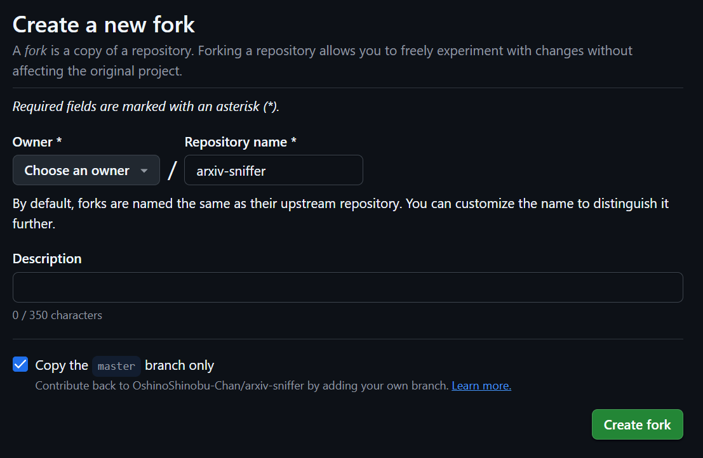

然后请你进入你自己账号下复制得到的那个项目进行下面的操作。

### 1. 配置文件

本项目利用`toml`格式的配置文件进行配置。你不懂`toml`也没关系，项目中为你提供了完善的样例，照葫芦画瓢就行了。这里我只介绍必要的配置项，如果你想快速开始体验，其他没有提到的部分保持默认就行了。配置文件你可以在[这里](./config.toml)找到。

- **subject_code**: 第4行，你可以把引号中的"cs"给改成你的领域在arXiv上的代号。

    你可以在arXiv上下面这个位置选择你的领域，然后点击search。这时查看浏览器上的网址，应该是类似于`https://arxiv.org/search/physics`的内容，最后一个`/`后面的那个是你的领域的代号。
    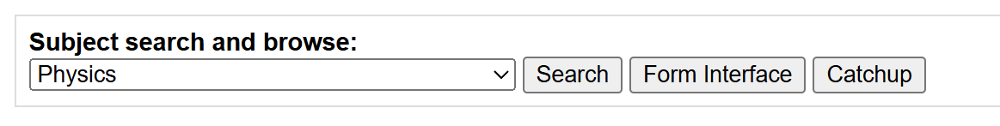

- **topics**：这个配置项会稍微有一点复杂。请你仿照着默认配置文件中的14~20行来。

    你可以看到，这个位置有两个`[[topics]]`单独一行，然后下面都紧跟着两行`name = xxx`和`description = xxx`。

    这里的每个`[[topics]]`为一组，是一个订阅的主题。
    
    每个`[[topics]]`下面的`name`就是这个主题的名字。这个名字将会展示在自动构建的网站的导航栏上。请你取一个简短的名字。可以包含中文，但是最好不要使用奇怪的字符。
    
    下面的`description`，你可以使用一小段话描述你关心的主题具体是什么。大模型将会通过这个描述来判断一篇文章是否与你关心的主题相关。这里的内容请一定要使用`"`包括起来，但是其中的内容请不要再使用`"`。

    你需要订阅几个主题，这里就放几组。这里默认的配置文件中就是订阅了两个主题。

如果你是第一次使用GitHub，推荐你直接在页面上对配置文件进行修改。点击你的复制的项目页面上的`config.toml`，你将会进入下面这个界面。点击右上角的笔形状的图表就可以进入编辑界面了。

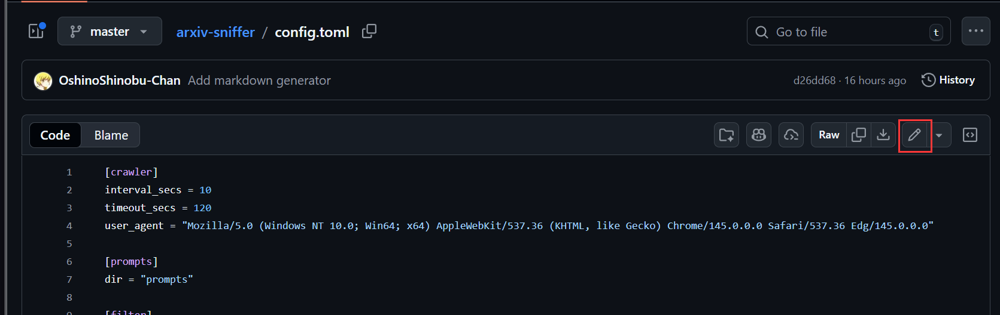

在编辑界面上你可以直接对文件内容进行修改。然后你点击界面右上角的`Commit changes..`按钮，就会弹出下面这样的窗口。在`Commit message`里面随便填入一点说明，然后点击右下角的`Commit changes`就修改成功了。

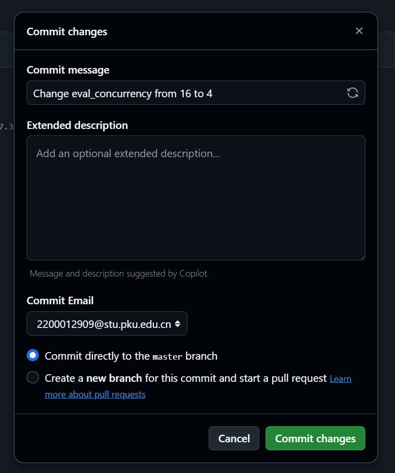

### 2. 配置DeepSeek API密钥

如何创建一个DeepSeek账号，充值并获取一个DeepSeek API密钥的过程，请你自己去询问DeepSeek。

> 注意：请不要把的你的密钥放到网上，或者让其他人知道你的密钥。

等你拥有了一个DeepSeek API密钥，你可以通过下面的操作在项目中添加你的密钥。

首先，点击你自己复制的项目上方靠右侧的`Settings`按钮，如下图。

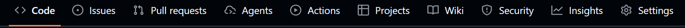

然后，在你进入的界面左侧找到下图红框中的这一栏，点击进入。

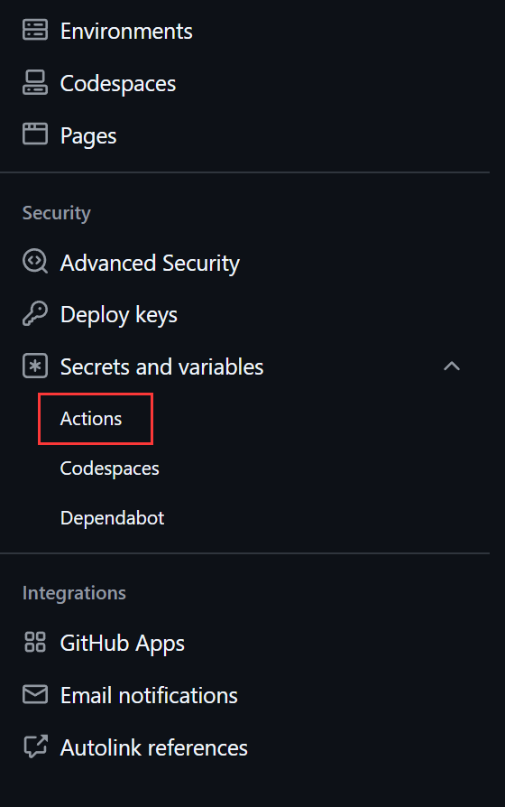

在如下的界面中点击`New repository secret`按钮。

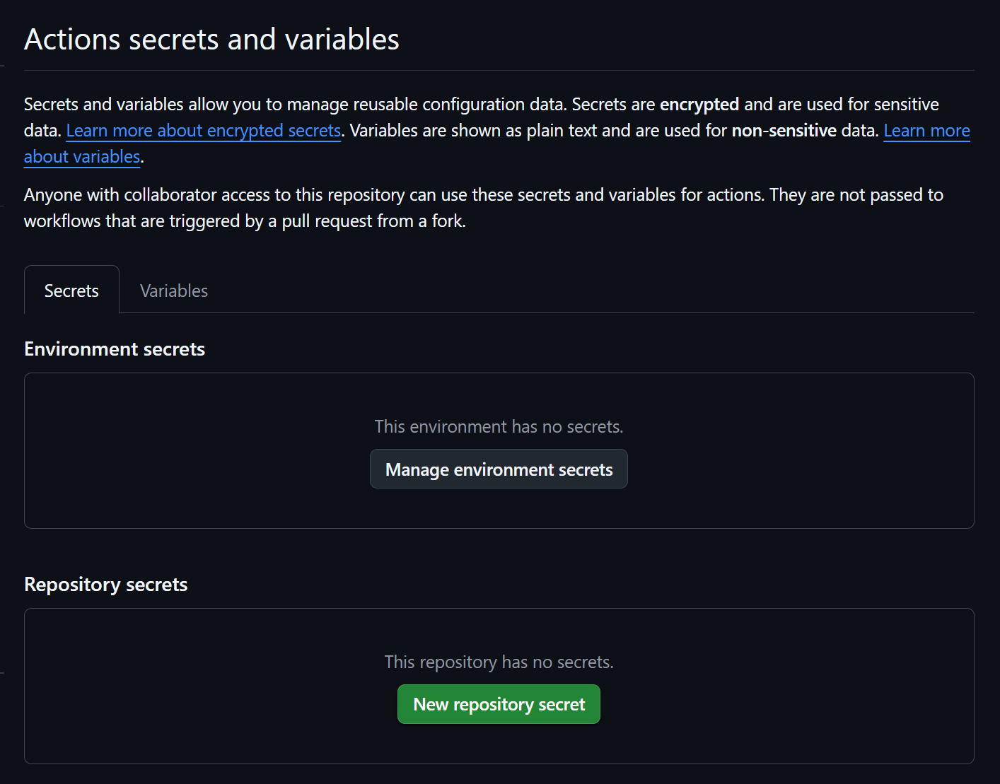

然后在下面界面中`Name`填入"DEEPSEEK_API_KEY"（需要完全一致），`Secret`里面就把你的DeepSeek API 密钥粘贴进去。最后点击`Add secret`就行了。

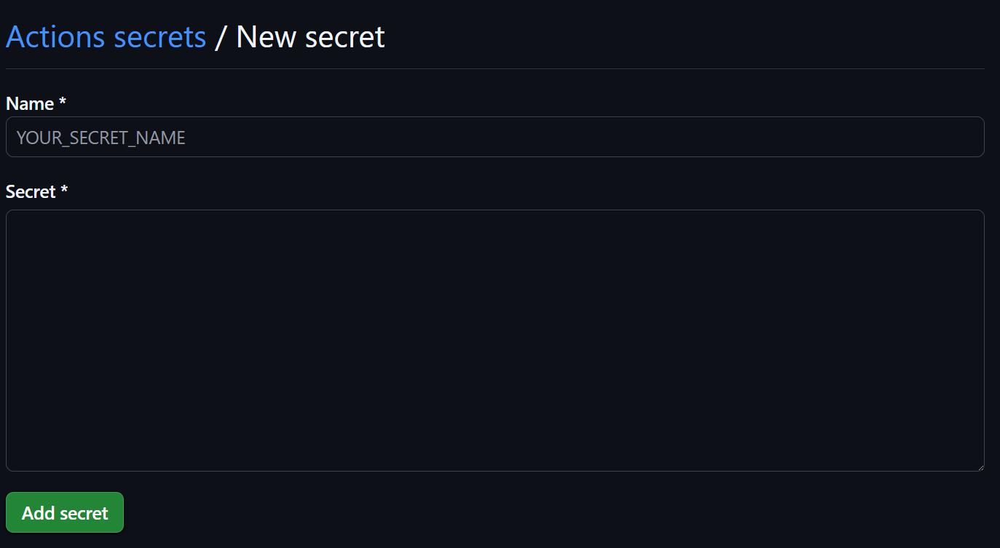

### 3. 配置Github Action

首先，你需要点击你复制的项目上方中间的`Actions`按钮。然后应该会出现下面这个界面。点击界面中间的绿色按钮。

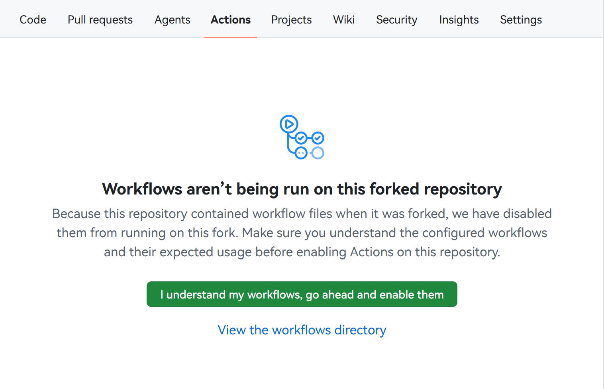

之后，你的页面左边应该会出现一个workflow，但是它应该是`Disabled`的。你需要点击这个workflow然后选择`Enable workflow`来启用它。这个任务就会每天定时启动了。

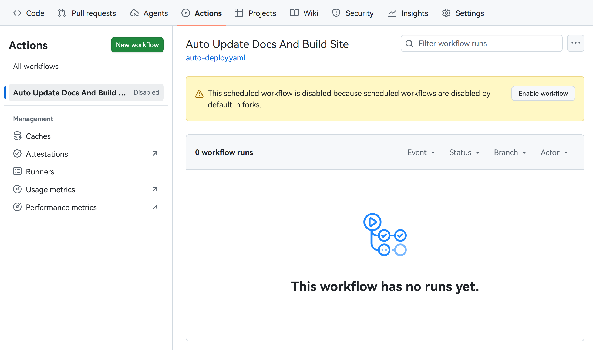

### 4. 创建site branch

最后，我们需要一点配置来将每天抓取筛选得到的结果自动部署到GitHub Page上。在这之前还需要个前置操作。回到刚才的`Code`界面，然后点击下图所示的地方。

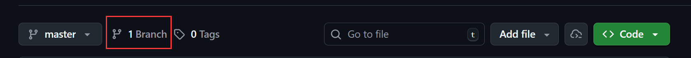

然后你点击界面右上角的`New branch`进入创建新branch的界面。如下图，你在上面的`New branch name`中填入`site`(需要完全一致)，然后点击`Create new branch`就完成了

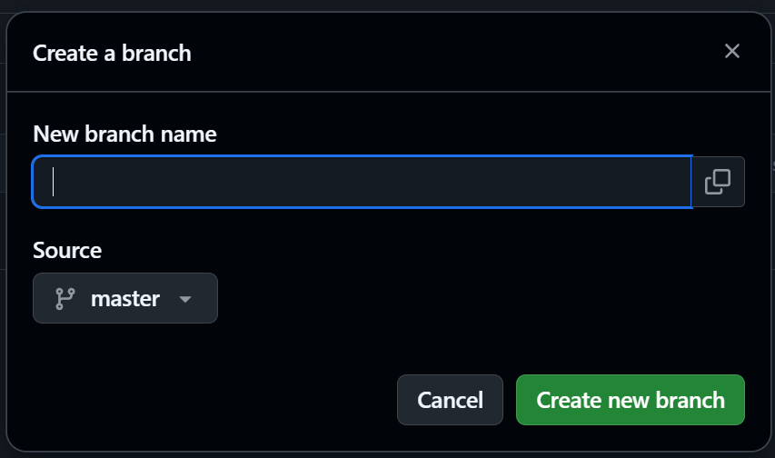

### 5. 配置GitHub Page

这是最后一步，配置GitHub Page来自动部署site branch。首先，你需要点击界面上方的`Settings`然后点击左侧的`Pages`(上面有相关示意图，我就不再放图了)。然后你就会进入类似下面的这个界面，点击中间`Branch`那一栏的下拉菜单，选中`site`，然后点击`save`，就完成了。

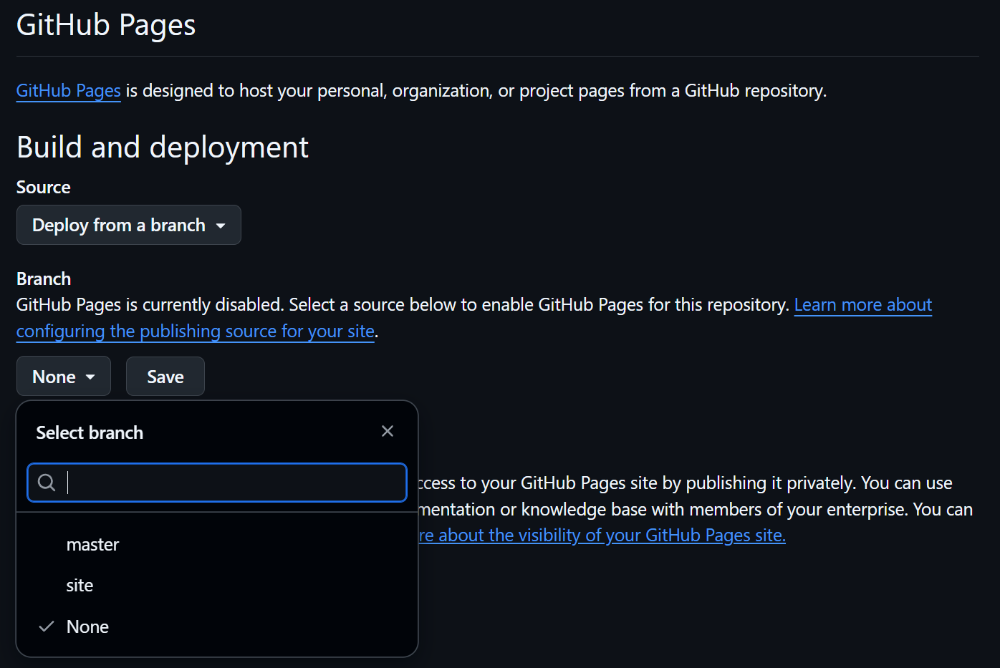

等待页面的自动部署完成，你的`Pages`界面上应该就会出现下面这个栏目，点击`Visit site`就可以访问属于你自己的网页了。当然，现在这个网站上应该只会显示目前这个README的内容。等第一天到时更新之后，这个网站的页面就会变成[示例](https://oshinoshinobu-chan.github.io/arxiv-sniffer/)中的这个样子了。

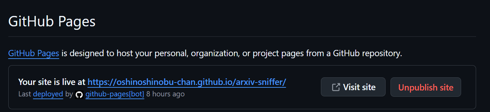

如果你想立即看到效果，也可以手动启动一次本项目。点击刚才的`Actions`界面，从左侧选择到`Auto Update Docs And Build Site`这一项(此时，你这里应该有两项，另一项是用来自动部署GitHub Page的)。然后在上方会出现类似下图的界面。点击`Run workflow`的下拉菜单，然后直接点击绿色的`Run workflow`即可手动出发一次本项目。正常情况下，在等待一段时间之后(时间跟你订阅的topic数量有关，一般至少20min)，下面出现图中这种绿色对钩就说明运行成功了。这时，你就可以去查看刚才的GitHub page网页了(可能需要刷新一下)。

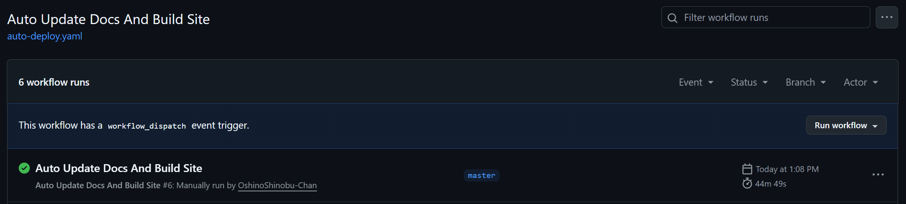

## 如何自定义自己的项目

### 自定义展示网站的风格

你主要可以通过修改mkdocs的[配置](./mkdocs/mkdocs.yml)和修改自动生成页面的模板来自定义展示网站的风格。

关于如何配置mkdocs，请你自己上网查找。

关于如何修改自动生成页面的模板，请你查看网站上的说明页面，或者[这里](./mkdocs/docs/readme.md)。

### 自定义相关性评价量表

如果你希望能够设计自己的相关性评价量表。你可以仿照[这里](./prompts/relevance_dimensions.json)进行修改。量表的项目数量也可以更改，但是要保证所有项目的权重之和为1。

### 自定义prompt

如果你希望能够设计自己的prompt。你可以仿照[这里](./prompts/relevance_template.txt)进行修改。下面解释一下每个匹配项的含义：

- `{topic}`：这里会被替换成你的配置文件当中主题的详细描述。
- `{title}`：这里会被替换成需要评估的论文的标题。
- `{abstract}`：这里会被替换成需要评估的论文的摘要原文。
- `{dimension_num}`：这里会被替换成量表中维度的数量。
- `{dimensions}`：这里会被替换成所有维度的名称以及它们对应的描述的列表。
- `{json_outputs}`：这里会被替换成要求大模型最终输出的格式的模板。

### 配置文件

下面利用注释说明了配置文件中各个配置项的含义。

```toml
// 爬虫有关的配置
[crawler]
// 爬取操作的间隔时间，目前用不上
interval_secs = 10
// 爬取单个网页的超时时间，如果你发现你的项目总是
timeout_secs = 120
subject_code = "cs"
// 爬虫在响应头中使用的user_agent
user_agent = "Mozilla/5.0 (Windows NT 10.0; Win64; x64) AppleWebKit/537.36 (KHTML, like Gecko) Chrome/145.0.0.0 Safari/537.36 Edg/145.0.0.0"

[prompts]
// prompts文件夹的路径，里面是量表和大模型prompt模板
dir = "prompts"

[filter]
// 筛选用的相关性评分阈值，大于这个分数的论文会被认为是与主题相关
relevance_threshold = 85
// 向大模型发送请求时的并发数量，可以提高程序的运行速度
eval_concurrency = 4

[[topics]]
name = "Agentic ai"
description = "对于多个Agent相互协作的Agentic AI系统中系统层面有关问题的研究，如系统延迟、系统架构设计等。"

[[topics]]
name = "RLHF/RLVF"
description = "大语言模型(LLM)的强化学习后训练(post-train)系统(RLHF/RLVF)中，系统层面性能优化方法的相关研究，包括对于系统延迟、吞吐量和计算资源利用率等方面的优化。"

[ai]

// 下面是大模型client的有关设置，具体请查看DeepSeek的文档
[ai.models."deepseek-chat"]
provider = "deepseek"
endpoint = "https://api.deepseek.com/chat/completions"
system_prompt = "You are a helpful assistant"
timeout_secs = 60

[ai.models."deepseek-chat".request]
model = "deepseek-chat"
thinking_type = "disabled"
frequency_penalty = 0.0
max_tokens = 4096
presence_penalty = 0.0
response_format_type = "text"
stream = false
temperature = 1.0
top_p = 1.0
tool_choice = "none"
logprobs = false

[ai.models."deepseek-reasoner"]
provider = "deepseek"
endpoint = "https://api.deepseek.com/chat/completions"
system_prompt = "You are a helpful assistant"
timeout_secs = 300

[ai.models."deepseek-reasoner".request]
model = "deepseek-reasoner"
thinking_type = "enabled"
frequency_penalty = 0.0
max_tokens = 32768
presence_penalty = 0.0
response_format_type = "text"
stream = false
temperature = 1.0
top_p = 1.0
tool_choice = "none"
logprobs = false
```

## 接下来会有什么

下一步，我打算提供对筛选出来的论文进行总结，和提取关键信息的功能。例如你将可以通过一个模板，让大模型帮你提取出论文的核心创新点、实验结果等。<del>毕竟我可是懒到连论文原文都懒得自己看的人（笑</del>

但是因为我比较懒，而且没太想好该如何将论文原文发送给大模型，所以这个功能可能没那么快？

## 如何贡献

如果你喜欢我的这个项目，欢迎你通过如下方式支持我的项目。

- 点一个Star(项目左上角)：stars可以提升项目的知名度，让更多人看到它。
- 提issue：如果你发现了项目的bug，或者你对项目的新功能有什么建议，欢迎你来提交issue。但是，当你遇到bug的时候，请提供尽量完整的信息，否则我可能会无视你。
- 贡献代码：上述提到的一些可以发展的新功能，也欢迎大家为我贡献代码。（毕竟我真的很懒，并且很随缘）